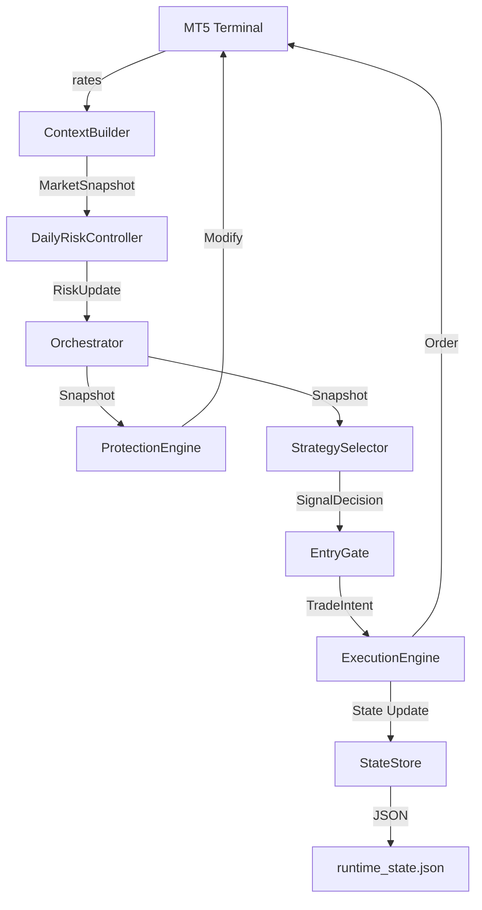
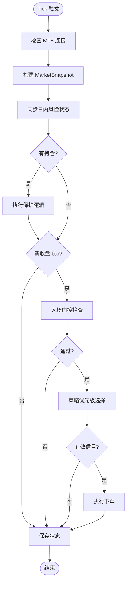
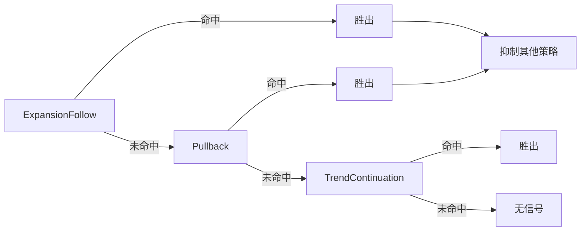
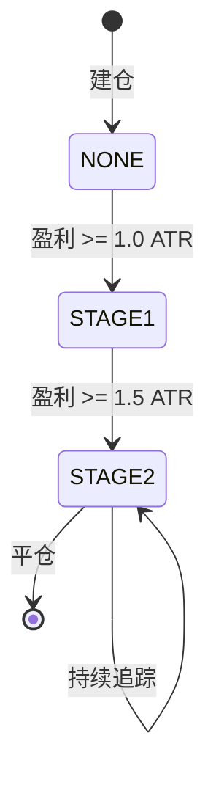
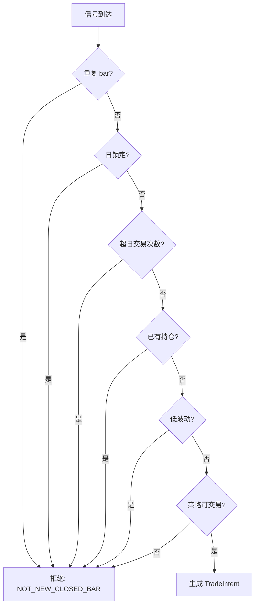
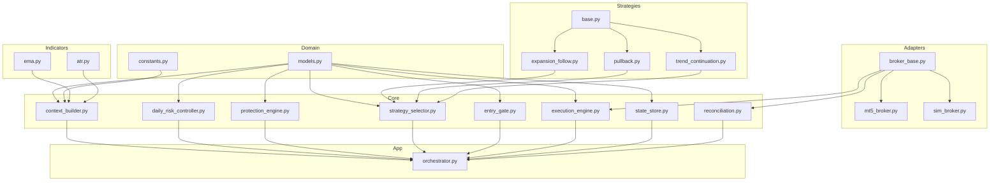
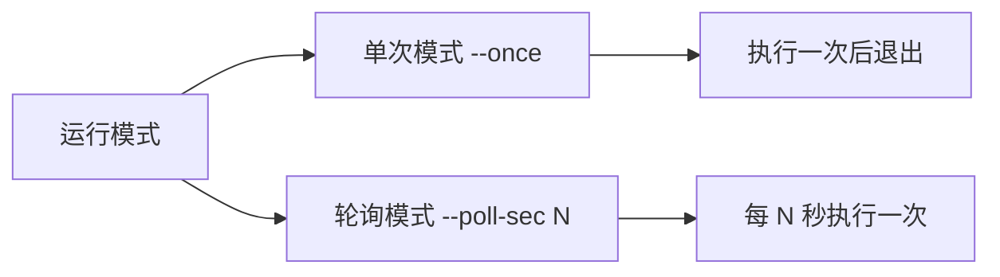

# Sanqing EA MT5 系统架构设计文档

## 1. 概述

### 1.1 系统定位
Sanqing EA MT5 是一个面向黄金交易的自动交易 Python 系统，专为 XAUUSD M5 周期设计。系统只负责策略分析和向本机 MT5 终端发送指令，不管理 MT5 账户登录或模拟盘/实盘切换。

### 1.2 核心原则
- **单一持仓原则**：单一 `symbol + magic` 只允许存在一个持仓
- **已收盘 K 线决策**：所有交易决策基于已收盘 K 线，不分析未收盘 bar
- **模块化分离**：信号、风控、执行、状态管理严格分离
- **幂等性保护**：防止重复提交和重复开仓

---

## 2. 系统架构概览

```
┌─────────────────────────────────────────────────────────────────────────┐
│                              User Layer                                 │
│                        [run.py] / [app/run.py]                          │
└─────────────────────────────────────────────────────────────────────────┘
                                    │
                                    ▼
┌─────────────────────────────────────────────────────────────────────────┐
│                           Application Layer                             │
│                      [src/app/orchestrator.py]                          │
│  ┌──────────────┐  ┌──────────────┐  ┌──────────────┐  ┌──────────────┐  │
│  │  Start Hook  │→ │ Load State   │→ │ Connect MT5  │→ │ Main Loop    │  │
│  └──────────────┘  └──────────────┘  └──────────────┘  └──────────────┘  │
└─────────────────────────────────────────────────────────────────────────┘
                                    │
                                    ▼
┌─────────────────────────────────────────────────────────────────────────┐
│                            Core Processing                              │
│  ┌──────────────────────────────────────────────────────────────────┐   │
│  │                    [src/core/context_builder.py]                  │   │
│  │  从 MT5 原始数据构建 MarketSnapshot（EMA/ATR/高低点统计）          │   │
│  └──────────────────────────────────────────────────────────────────┘   │
│                                    │                                    │
│  ┌──────────────────────────────────────────────────────────────────┐   │
│  │                   [src/core/daily_risk_controller.py]             │   │
│  │  日内风险状态同步（日锁定、日盈亏统计）                            │   │
│  └──────────────────────────────────────────────────────────────────┘   │
│                                    │                                    │
│  ┌──────────────────────────────────────────────────────────────────┐   │
│  │                     [src/core/protection_engine.py]               │   │
│  │  两阶段保护：STAGE1 保本 → STAGE2 追踪止盈                         │   │
│  └──────────────────────────────────────────────────────────────────┘   │
│                                    │                                    │
│  ┌──────────────────────────────────────────────────────────────────┐   │
│  │                    [src/core/strategy_selector.py]                │   │
│  │  优先级选择器：ExpansionFollow > Pullback > TrendContinuation     │   │
│  └──────────────────────────────────────────────────────────────────┘   │
│                                    │                                    │
│  ┌──────────────────────────────────────────────────────────────────┐   │
│  │                      [src/core/entry_gate.py]                     │   │
│  │  入场门控：重复bar过滤、日锁、交易次数、持仓检查、低波动过滤       │   │
│  └──────────────────────────────────────────────────────────────────┘   │
│                                    │                                    │
│  ┌──────────────────────────────────────────────────────────────────┐   │
│  │                    [src/core/execution_engine.py]                 │   │
│  │  执行引擎：幂等保护、重试机制、状态更新                            │   │
│  └──────────────────────────────────────────────────────────────────┘   │
│                                    │                                    │
│  ┌──────────────────────────────────────────────────────────────────┐   │
│  │                     [src/core/state_store.py]                     │   │
│  │  状态持久化：JSON 原子写入，支持重启恢复                           │   │
│  └──────────────────────────────────────────────────────────────────┘   │
└─────────────────────────────────────────────────────────────────────────┘
                                    │
                                    ▼
┌─────────────────────────────────────────────────────────────────────────┐
│                             Adapters Layer                              │
│  ┌──────────────────────────────────────────────────────────────────┐   │
│  │                      [src/adapters/broker_base.py]                │   │
│  │                         Abstract Interface                         │   │
│  │  ┌──────────────────┐    ┌──────────────────┐                     │   │
│  │  │ MT5BrokerAdapter │    │  SimBrokerAdapter│                     │   │
│  │  │ [mt5_broker.py]  │    │  [sim_broker.py] │                     │   │
│  │  │ 连接真实 MT5     │    │  模拟回测       │                     │   │
│  │  └──────────────────┘    └──────────────────┘                     │   │
│  └──────────────────────────────────────────────────────────────────┘   │
└─────────────────────────────────────────────────────────────────────────┘
```

---

## 3. 模块详细说明

### 3.1 Adapters 层（适配层）

| 模块 | 文件 | 职责 |
|------|------|------|
| BrokerAdapter | `src/adapters/broker_base.py` | 抽象接口：connect/get_rates/get_position/send_order/modify_position/close_position |
| MT5BrokerAdapter | `src/adapters/mt5_broker.py` | 真实 MT5 连接实现，使用 MetaTrader5 库 |
| SimBrokerAdapter | `src/adapters/sim_broker.py` | 模拟 Broker，用于测试和回测 |

### 3.2 Core 层（核心流程）

| 模块 | 文件 | 职责 |
|------|------|------|
| ContextBuilder | `src/core/context_builder.py` | 基于已收盘 K 线构建 MarketSnapshot，计算 EMA/ATR 及历史统计指标 |
| DailyRiskController | `src/core/daily_risk_controller.py` | 日盈亏锁定控制，服务器日切换时重置状态 |
| ProtectionEngine | `src/core/protection_engine.py` | 持仓保护逻辑：Stage1 保本、Stage2 追踪止盈 |
| StrategySelector | `src/core/strategy_selector.py` | 策略优先级调度器，按固定顺序评估策略 |
| EntryGate | `src/core/entry_gate.py` | 入场门控：过滤重复 bar、日锁、次数限制、持仓检查、低波动 |
| ExecutionEngine | `src/core/execution_engine.py` | 执行引擎：幂等保护、重试机制、状态更新 |
| StateStore | `src/core/state_store.py` | 运行时状态持久化，原子写入 JSON |
| Reconciliation | `src/core/reconciliation.py` | 状态对账：启动时对比持久化状态与 MT5 实际持仓 |

### 3.3 Strategies 层（策略层）

| 策略 | 文件 | 优先级 | 核心逻辑 |
|------|------|--------|----------|
| ExpansionFollow | `src/strategies/expansion_follow.py` | 1（最高）| 大实体、高量能、有效突破的扩张 K 线 |
| Pullback | `src/strategies/pullback.py` | 2 | 趋势回调入场 |
| TrendContinuation | `src/strategies/trend_continuation.py` | 3 | 趋势延续入场 |

### 3.4 Domain 层（领域模型）

| 模块 | 文件 | 内容 |
|------|------|------|
| Models | `src/domain/models.py` | MarketSnapshot、SignalDecision、TradeIntent、RuntimeState、ProtectionState |
| Constants | `src/domain/constants.py` | 默认值、枚举、配置常量 |

### 3.5 Indicators 层（指标层）

| 模块 | 文件 | 职责 |
|------|------|------|
| EMA | `src/indicators/ema.py` | EMA 快速/慢速计算 |
| ATR | `src/indicators/atr.py` | ATR(14) 波动率计算 |

---

## 4. 数据流图



---

## 5. 主流程执行顺序



---

## 6. 策略优先级与抑制逻辑



---

## 7. 保护引擎两阶段状态机



| 阶段 | 触发条件 | 动作 | 止损位置 | 止盈位置 |
|------|----------|------|----------|----------|
| NONE | 建仓后 | 持有 | 初始 SL | 初始 TP |
| STAGE1 | 盈利 >= 1.0 ATR | 修改 SL/TP | 入场价 + 缓冲 | 入场价 + 1.8 ATR |
| STAGE2 | 盈利 >= 1.5 ATR | 追踪 SL/TP | 最高价 - 距离 | 最高价 + 距离 |

---

## 8. 入场门控检查顺序



---

## 9. 模块依赖关系



---

## 10. 配置与参数

### 10.1 运行时配置 (config/runtime.ini)

```ini
[runtime]
log_path = logs/runtime.log
state_path = state/runtime_state.json
```

### 10.2 系统默认参数

| 参数 | 默认值 | 说明 |
|------|--------|------|
| MagicNumber | 20260313 | 订单标识 |
| Symbol | XAUUSD | 交易品种 |
| Timeframe | 5 | M5 周期 |
| EMAFastPeriod | 9 | 快 EMA 周期 |
| EMASlowPeriod | 21 | 慢 EMA 周期 |
| ATRPeriod | 14 | ATR 周期 |
| FixedLots | 0.01 | 固定手数 |
| MaxTradesPerDay | 30 | 日最大交易次数 |
| DailyProfitStopUsd | 50.0 | 日止盈锁定金额 |
| Slippage | 30 | 滑点 |
| MaxRetries | 6 | 下单重试次数 |

---

## 11. 错误处理策略

| 层级 | 错误类型 | 处理方式 |
|------|----------|----------|
| Broker | 连接失败 | 启动时抛 ConnectFailedError |
| Broker | 下单失败 | 返回 retryable 标志，执行引擎重试 |
| Broker | 不可重试错误 | 直接返回失败，不重试 |
| StateStore | 文件不存在 | 允许首次启动，创建新状态 |
| StateStore | 文件损坏 | 抛 StateStoreCorruptedError |
| ContextBuilder | 数据不足 | 抛 InsufficientBarsError |

---

## 12. 测试策略

| 测试类型 | 覆盖范围 | 示例文件 |
|----------|----------|----------|
| 单元测试 | 指标计算、模型验证、工具函数 | `tests/unit/test_*.py` |
| 集成测试 | Broker 适配、执行引擎、状态持久化 | `tests/integration/test_*.py` |
| E2E 测试 | 语义回归、完整流程验证 | `tests/e2e/test_semantics_regression.py` |

---

## 13. 扩展性设计

### 13.1 添加新策略
1. 继承 `BaseStrategy`
2. 实现 `name`、`can_trade`、`build_intent`
3. 在 `StrategySelector` 中注册

### 13.2 添加新 Broker 适配
1. 继承 `BrokerAdapter`
2. 实现所有抽象方法
3. 在配置中选择适配器

### 13.3 添加新指标
1. 在 `src/indicators/` 创建模块
2. 在 `ContextBuilder` 中集成计算
3. 更新 `MarketSnapshot` 字段

---

## 14. 运行模式



---

## 15. 关键文件索引

| 类别 | 文件路径 | 说明 |
|------|----------|------|
| 入口 | `run.py` | 推荐主入口 |
| 编排 | `src/app/orchestrator.py` | 主流程编排 |
| 配置示例 | `config/runtime.ini.example` | 配置模板 |
| 需求文档 | `mt5-rewrite-requirements.md` | 详细需求规格 |

---

*文档生成时间: 2026-04-04*
*系统版本: 基于 mt5-rewrite-requirements.md 规格实现*
